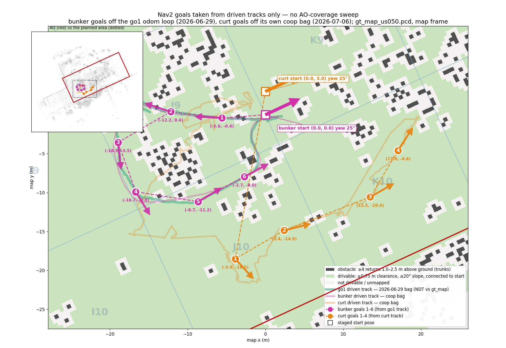

# Nav2 goal plan — goals taken from driven tracks only

Ten Nav2 goals — **6 for `bunker`, 4 for `curt`** — every one of them standing on
ground a robot has already driven over. This is **not** an area-coverage plan: no
attempt is made to sweep the I8–O10 AO, and there are no goals on ground with no
driven evidence behind it (§4).

Positions are in the **`map` frame** of
[../../hmr_localisation/gt_map/gt_map_us050.pcd](../../hmr_localisation/gt_map/gt_map_us050.pcd),
the frame each robot's NDT localizer publishes into, so they can be sent as-is.
AO geometry and start poses follow
[../../../../doc/experiment_script_forest_inspection.md](../../../../doc/experiment_script_forest_inspection.md).



Magenta = `bunker`, orange = `curt`, teal = the `go1` track the `bunker` goals come
from. Filled discs are the goals (numbered, with map coordinates and a heading
arrow); the thick translucent lines are the driven tracks; green is drivable ground.

## 1. `bunker` — 6 goals, off the `go1` odom track

Start (0.00, 0.00) yaw 25°. West / +`v` loop, cells **J9 → J10**.
Straight-line path **42 m**.

| # | x (m) | y (m) | yaw (°) | cell | ground z (m) | clearance (m) | off own track (m) |
| ---: | ---: | ---: | ---: | --- | ---: | ---: | ---: |
| 1 | **-5.59** | **-0.42** | 176.7 | J9 | 0.11 | 1.60 | 0.1 |
| 2 | **-12.18** | **0.39** | 161.9 | J9 | 1.36 | 1.77 | 0.2 |
| 3 | **-18.93** | **-3.55** | -84.0 | J9 | 2.13 | 2.55 | 0.5 |
| 4 | **-16.67** | **-9.89** | -58.5 | J9 | 1.90 | 3.05 | 0.6 |
| 5 | **-8.65** | **-11.16** | 30.4 | J10 | 0.68 | 2.30 | 0.8 |
| 6 | **-2.70** | **-7.97** | 28.5 | J10 | -0.23 | 1.12 | 0.1 |

## 2. `curt` — 4 goals, off its own coop-bag track

Start (0.00, 3.00) yaw 25°. South-east / −`v` leg, cells **J10 → K10**.
Straight-line path **48 m**.

| # | x (m) | y (m) | yaw (°) | cell | ground z (m) | clearance (m) | off own track (m) |
| ---: | ---: | ---: | ---: | --- | ---: | ---: | ---: |
| 1 | **-3.88** | **-18.51** | -47.7 | J10 | 0.23 | 3.25 | 0.0 |
| 2 | **2.42** | **-14.86** | 14.0 | J10 | -0.68 | 3.75 | 0.0 |
| 3 | **13.47** | **-10.57** | 29.8 | K10 | -2.46 | 4.67 | 0.0 |
| 4 | **17.04** | **-4.59** | 57.1 | K10 | -2.99 | 4.16 | 0.0 |

## 3. How the goals were chosen

One rule: **walk each driven track and drop a goal every ~11 m of driven path**,
keeping ≥ 6.5 m between goals, and within ±3 m of arc pick the pose with the most
obstacle clearance. Yaw is the robot's own direction of travel there — a heading
already demonstrated to work at that spot.

- `bunker` takes the west/+`v` loop; `curt` takes the south-east/−`v` leg. Any
  `curt` candidate within 8 m of the `go1` corridor was rejected, which is why
  `curt`'s goals start 52 m into its track: everything before that runs down the
  corridor `bunker` will be working.
- **The two robots are not in separate areas — read §3.1 before running them.**
- Clearance at every goal is **≥ 1.12 m** (grid in §5), and every `bunker` goal
  lies **within 0.9 m of `bunker`'s own driven track** as well as the `go1` one,
  so the `go1`'s smaller footprint is not doing any load-bearing work here.
- The first ~15 m of each track is skipped, so no goal lands on top of a start pose.

### 3.1 The two robots share one patch — measured

Separating the *goals* is not the same as separating the *robots*, and only the
first is achieved here:

| | |
| --- | --- |
| Closest goal of one robot to a goal of the other | **8.6 m** (`bunker` 6 ↔ `curt` 2) |
| Goal lanes across the rows (`v`) | disjoint, **4.8 m gap** (`bunker` −6.5…+5.5, `curt` −15.3…−11.3) |
| Convex hull of both goal sets together | **409 m²** — one patch spanning cells J9/J10/K10, out of an 8400 m² AO |
| Commanded straight-line routes | **cross; closest approach 0.0 m.** 16 % of `bunker`'s route lies within 3 m of `curt`'s, 34 % within 6 m |
| `curt`'s 22 m transit from its start to goal 1 | passes **0.7 m from `bunker` goal 6**, and crosses `bunker`'s commanded route |

This is inherent to the evidence, not a planning slip: both bags leave the same
deployment point, and 15 % of `curt`'s driven poses are within 3 m of ground
`bunker` also drove. Goals that are both evidence-backed **and** far apart do not
exist in this bag set.

Two ways to handle it, in order of preference:

1. **Launch `curt` first** and let it clear its transit south before `bunker`
   starts west. `bunker`'s goals 5–6 are its *return* leg, so the crossing zone is
   occupied by the two robots at opposite ends of their runs.
2. **Drop `bunker` goal 6** (0.7 m off `curt`'s transit, and the lowest-clearance
   goal in the set at 1.12 m). `bunker` then ends at goal 5, 6.0 m clear of the
   transit line and 8.8 m from the nearest `curt` goal.

Either way the robot–robot separation still needs watching live: the documented
panic threshold is 1.5 m. Since this was written the planner has grown an
automated first line of defence — the coordinated proximity stop (README
§"Coordinated proximity stop"): the lex-larger robot (`curt`) cancels its nav
goal and holds when the pair closes inside `proximity_hold_dist_m` (5 m — sized
so the >1 s of pose lag + cancel + braking still stops short of the panic
line). On hardware, wire `proximity_peer_pose_topics` at the peers' `pcl_pose`
so the guard runs on 10 Hz localiser poses rather than 1 Hz intent heartbeats
(the planner warns until this is done). It is best-effort coordination, not a
safety function; the crewed panic stop stays.

## 4. Provenance of the `go1` track — and what it does *not* add

**The `go1` bag has no odometry topic.** Its `/tf` stream is 10 710 messages of
leg-joint transforms only (12 edges, `trunk → *_hip → *_tight → *_calf`); there is
no `odom → base_link` and no `/odom`. So the track was recovered the documented
way: replay
[`2026_06_29_16_22_18__go1_kalhan_coop_2_`](../../../../../Bags/2026_06_29_16_22_18__go1_kalhan_coop_2_)
through the NDT stack against the same `gt_map`, using the committed
[gt_ouster_ndt_tree_go1.yaml](../../hmr_localisation/config/gt_ouster_ndt_tree_go1.yaml)
(pinned initial pose x 2.75, y −0.50, yaw 106°) plus
[ekf_odom_go1.yaml](../../hmr_localisation/config/ekf_odom_go1.yaml) for
`odom → base_link`. Result: **3929 poses over the full 214 s, 97 m of path**
(102 relock steps > 0.5 m dropped from the arc-length count).

**The `go1` walked the same corridor as `bunker`.** Nearest-neighbour distance from
each `go1` pose to the `bunker` coop-bag track: **median 0.16 m, 90th percentile
0.60 m, nothing beyond 3 m**. Two robots, two bags a week apart, localized
independently — that is a strong cross-check on the NDT pins, but it means the
`go1` run opens up **no ground the coop bags did not already cover**. There are
only two distinct driven sides in the whole bag set:

| Side | Evidence | Extent (row frame) | Assigned to |
| --- | --- | --- | --- |
| West / +`v` loop | `go1` bag **and** `bunker` coop bag | `u` −20 … +2, `v` −6 … +9 | `bunker` |
| South-east / −`v` leg | `curt` coop bag only | `u` −22 … +18, `v` −19 … +5 | `curt` |

What that leaves untouched, deliberately: **SA-2, SA-3, all of row 8, and
everything east of `u` ≈ 15 or north of `v` ≈ +9** — i.e. most of the AO. The
goals span `u` ∈ [-19, 14], `v` ∈ [-15, 6] — a bounding box of about
8 % of the AO's footprint, and only 409 m² of hull inside it (§3.1). Extending past that means either
flying/driving a survey first or accepting goals on unverified ground.

## 5. The drivability grid (background layer only)

The green/grey layer in the figure, and the clearance column, come from the
bag-calibrated model: obstacle = **≥ 4 returns 1.0–2.5 m above a robust plane-fit
DTM** per 0.5 m column, clearance **> 0.75 m** by a 0.25 m distance transform,
slope > 20° impassable. That model admits 88 % of `bunker`'s and 90 % of `curt`'s
driven poses. It is used here only to *score* candidate goals on the tracks — the
tracks themselves are the evidence.

An earlier band (≥ 2 returns, 0.4–2.2 m) put 98 % of `bunker`'s and 78 % of
`curt`'s real track in "impassable" cells; in this stand that band is mostly
drive-through understory.

## 6. Sending them

`z = 0`, orientation is a pure yaw about map z. Publish to each robot's own
`/<robot>/goal_pose`, or feed the list to `FollowWaypoints`. That is the topic
`explo_planner` also drives
([explo_planner_node.cpp:821](../src/explo_planner_node.cpp#L821)), so only one of
the two may own a robot at a time.

```yaml
# frame_id: map, in execution order
goal_plan:
  bunker:            # from the go1 odom track
    poses:
      - { id: 1, x:   -5.59, y:   -0.42, z: 0.0, qz:  0.9996, qw: 0.0288 }   # J9  yaw  176.7°  ground z  0.11
      - { id: 2, x:  -12.18, y:    0.39, z: 0.0, qz:  0.9876, qw: 0.1573 }   # J9  yaw  161.9°  ground z  1.36
      - { id: 3, x:  -18.93, y:   -3.55, z: 0.0, qz: -0.6691, qw: 0.7431 }   # J9  yaw  -84.0°  ground z  2.13
      - { id: 4, x:  -16.67, y:   -9.89, z: 0.0, qz: -0.4886, qw: 0.8725 }   # J9  yaw  -58.5°  ground z  1.90
      - { id: 5, x:   -8.65, y:  -11.16, z: 0.0, qz:  0.2622, qw: 0.9650 }   # J10  yaw   30.4°  ground z  0.68
      - { id: 6, x:   -2.70, y:   -7.97, z: 0.0, qz:  0.2462, qw: 0.9692 }   # J10  yaw   28.5°  ground z -0.23
  curt:              # from the curt coop-bag track
    poses:
      - { id: 1, x:   -3.88, y:  -18.51, z: 0.0, qz: -0.4043, qw: 0.9146 }   # J10  yaw  -47.7°  ground z  0.23
      - { id: 2, x:    2.42, y:  -14.86, z: 0.0, qz:  0.1219, qw: 0.9925 }   # J10  yaw   14.0°  ground z -0.68
      - { id: 3, x:   13.47, y:  -10.57, z: 0.0, qz:  0.2571, qw: 0.9664 }   # K10  yaw   29.8°  ground z -2.46
      - { id: 4, x:   17.04, y:   -4.59, z: 0.0, qz:  0.4779, qw: 0.8784 }   # K10  yaw   57.1°  ground z -2.99
```

```bash
# bunker goal 1 by hand
ros2 topic pub --once /bunker/goal_pose geometry_msgs/msg/PoseStamped \
  '{header: {frame_id: map}, pose: {position: {x: -5.59, y: -0.42, z: 0.0},
   orientation: {z: 0.9996, w: 0.0288}}}'
```

## 7. Notes for the run

- **Launch `curt` first, then `bunker`** — see §3.1. Both robots stage within 3 m
  of each other, both leave down the same corridor, and `curt` has to cross 22 m of
  `bunker`'s patch before it reaches its own leg. This is the one real conflict in
  the plan.
- Ground falls along both routes — `bunker` +2.13 … −0.23 m, `curt` +0.23 … −2.99 m —
  well inside the AO's ~14 m relief, but the ROI z band still has to follow it.
- Total commanded path is ~90 m for the pair, a fraction of the 55-minute
  battery budget. If there is time left, the honest way to extend is a fresh survey
  pass, not more goals guessed off the point cloud.
